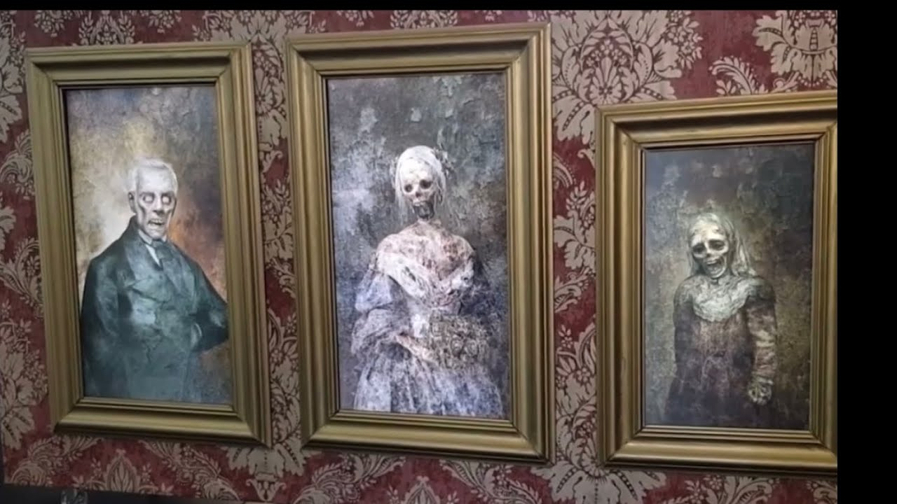

# Projeto HelloWinners 2023
 Este projeto foi desenvolvido para uma festa de haloween. 
 A inspiração veio apartir deste video (https://www.youtube.com/watch?v=d2Ej5HOMNPk) e apartir deste ponto decidimos que iriamos fazer igual, mas durante todo o processo de pesquisa não cheguei a encontrar um repositório que ja teria um projeto desenvolvido ou ao menos alguma parte.
 Como não tivemos muita informação técnica localizada foi iniciado o processo de desenvolvimento do projeto com o conhecimento que tinhamos para conseguir desenvolver a parte fisica do projeto e os códigos do zero.
 Neste projeto foi usado um Raspberry Pi 3,um módulo do sensor HC-SR04 para identificar quando uma pessoa passou em frente do quadro.

O código foi desenvolvido de uma maneira que de momento não vejo que esteja bom, preciso refatorar muitos pontos que de fato não estão escrito da melhor maneira.... mas de momento ele esta rodando da forma que esperamos para executar a tarefa desejada. Como durante o processo de teste de qual linguagem rodaria e pelo fato de pouco tempo que tinhamos para o desenvolvimento foi definido que Python seria a melhor linguagem para reduzir o tempo de desenvolvimento e estivesse pronto dentro do tempo esperado.

## Código
Levando em consideração o pouco tempo que tinhamos para desenvolver o projeto acabei definindo em desenvolver com base em Python para executar os videos e controlar o sensor de proximidade. Visto que era necessário que o projeto pudesse estar preparado para caso ele fosse reiniciado e de facil inicialização fiz alguns ajustes no Raspibian para que ele não mostrasse nada na tela de inicio, iniciasse automatimente o projeto e ficasse pronto para detectar a primeira pessoa ao passar em frente.
Durante o desenvolvimento percebi a necessidade de colocar um servidor Samba para que facilitasse a transferencia dos arquivos, e neste momento do código só foi implementado as coisas simples mas seria ideal criar um painel ADM para que pudesse transferir os arquivos de maneira mais amigavel e até controle do projeto pelo painel.

Em questão de bibliotecas foi usado: Python3, Samba, pigpio, vlc, python-vlc.

### Montando o quadro
Para a montagem do quadro retiramos o frame dos monitores, desmontamos o monitor até ter acesso a caixa de som. Para melhor construção da moldura deixamos o monitor na loja para que as medidas e ajustes necessários pudessem ser feitos de uma melhor forma.

A loja em questão nos ajudou já deixando o monitor preso na moldura, então esta parte da fixação foi mais simples pois da forma que montaram com pequenos pregos para prender na moldura ficaram bem firmes!

Depois disso procuramos uma maneira para prender o quadro na parede, o peso total do projeto ficou bem pesado para um barbante e parafuso segurar, então seguimos para colocar um gancho na parede preso com uma bucha para ficar bem firme e uma corrente igual usada nos vasos de flor suspensos. Ao colocar na parede precisamos ajustar bastante pois entre a parede e a parte de tras do quadro existia uma distancia causada pela fonte do monitor, mas assim que apagamos as luzes vimos que o ambiente ajudou a esconder essa visão de tras do monitor!

(esqueci de tirar fotos deste momento para mostrar a forma que usamos)

#### Finalização

Para a finalização escondemos o fio de eneria que estava subindo do quadro para o topo da parede e depois seguindo para tomada, e para tentar dar uma enganada colocamos outros quadros decorativos em volta! O video abaixo é o resultado final!

(https://youtu.be/hinEzlesKDg)